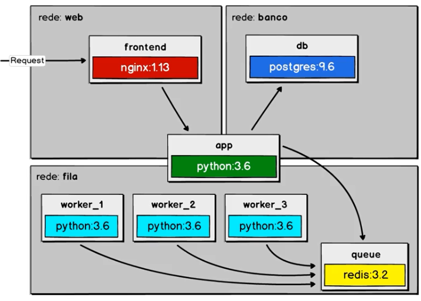
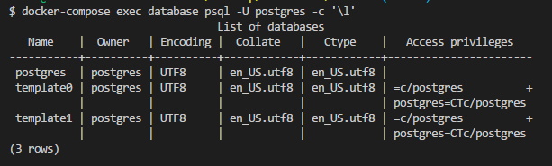

# Workers: 10 passsos para criar uma aplicação

- [x] Iniciando a composição com o banco de dados
- [ ] Usando volumes e scripts de banco de dados
- [ ] Começando nossa camada de front-end
- [ ] Aplicativo para enfileirar as mensagens
- [ ] Configurando um proxy reverso
- [ ] Redes, dependência e banco de dados
- [ ] Fila e workers
- [ ] Escalar é preciso...
- [ ] 12 Factors
- [ ] Sobreescrevendo localmente



## Commands

- Run commands inside the container with docker-compose
```prompt
docker-compose exec database psql -U postgres -c '\l'
```


