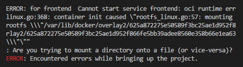

# Workers: 10 passsos para criar uma aplicação

- [x] Iniciando a composição com o banco de dados
- [x] Usando volumes e scripts de banco de dados
- [x] Começando nossa camada de front-end
- [x] Aplicativo para enfileirar as mensagens
- [x] Configurando um proxy reverso
- [x] Redes, dependência e banco de dados
- [ ] Fila e workers
- [ ] Escalar é preciso...
- [ ] 12 Factors
- [ ] Sobreescrevendo localmente


## Commands

- Show containers logs
```prompt
docker-compose logs -f -t
```

- Run commands inside the container with docker-compose `list databases`
```prompt
docker-compose exec database psql -U postgres -c '\l'
```


- Execute the file `-f` and list postegres
```prompt
docker-compose exec database psql -U postgres -f ./scripts/check.sql
```

- Select database tables data on docker container
```prompt
docker-compose exec database psql -U postgres -d email_sender -c 'select * from emails'
```

### Are you trying to mount a directory onto a file (or vice-versa)?

- Create the `.conf` file manually on prompt
```prompt
touch my.conf
```

- After: Remove all volumes that are associated to the container
```prompt
docker volume rm $(docker volume ls -q)
```


